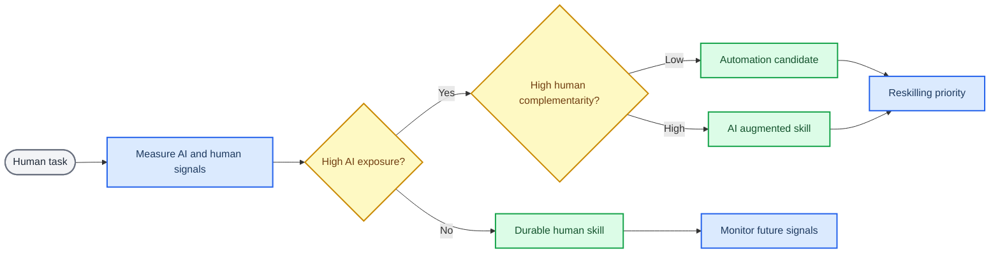
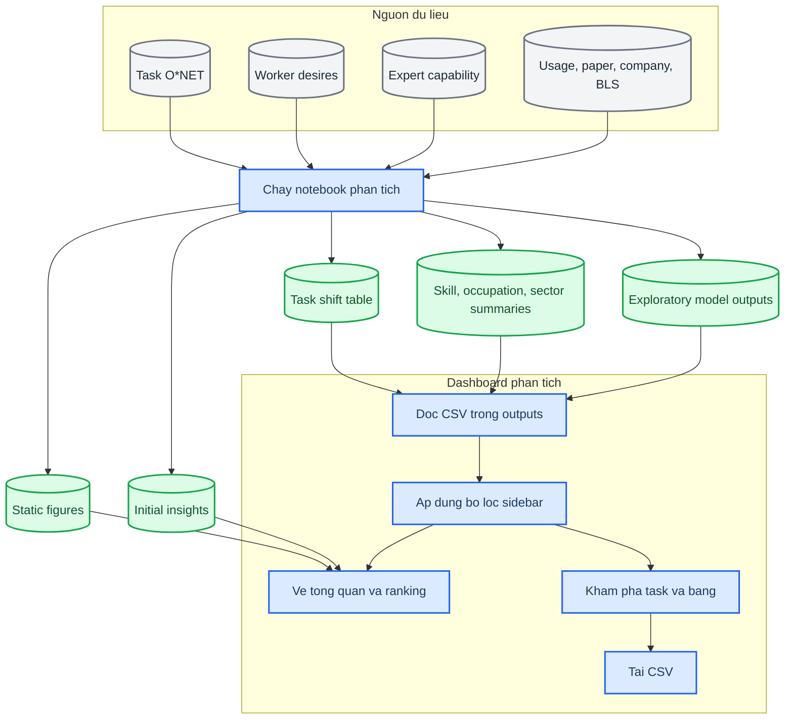
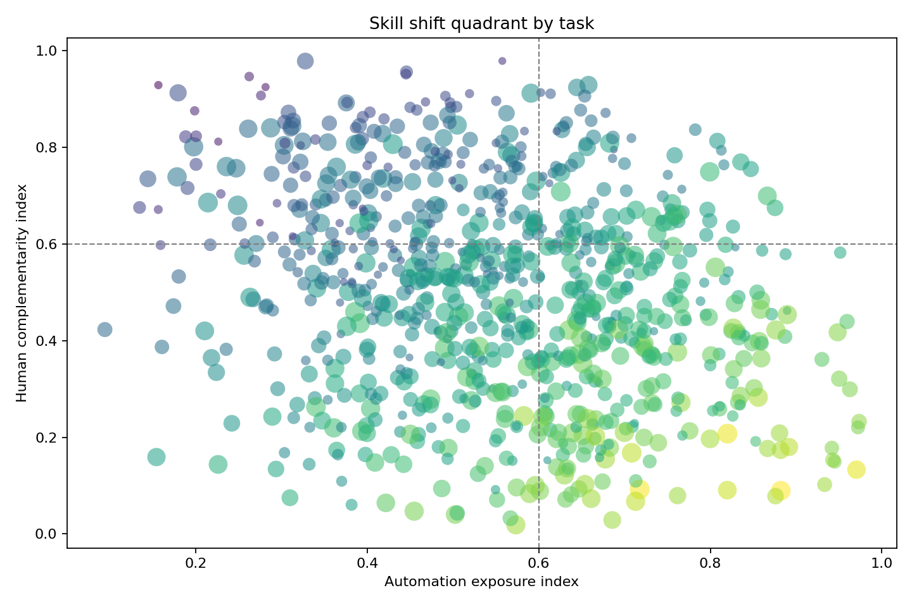
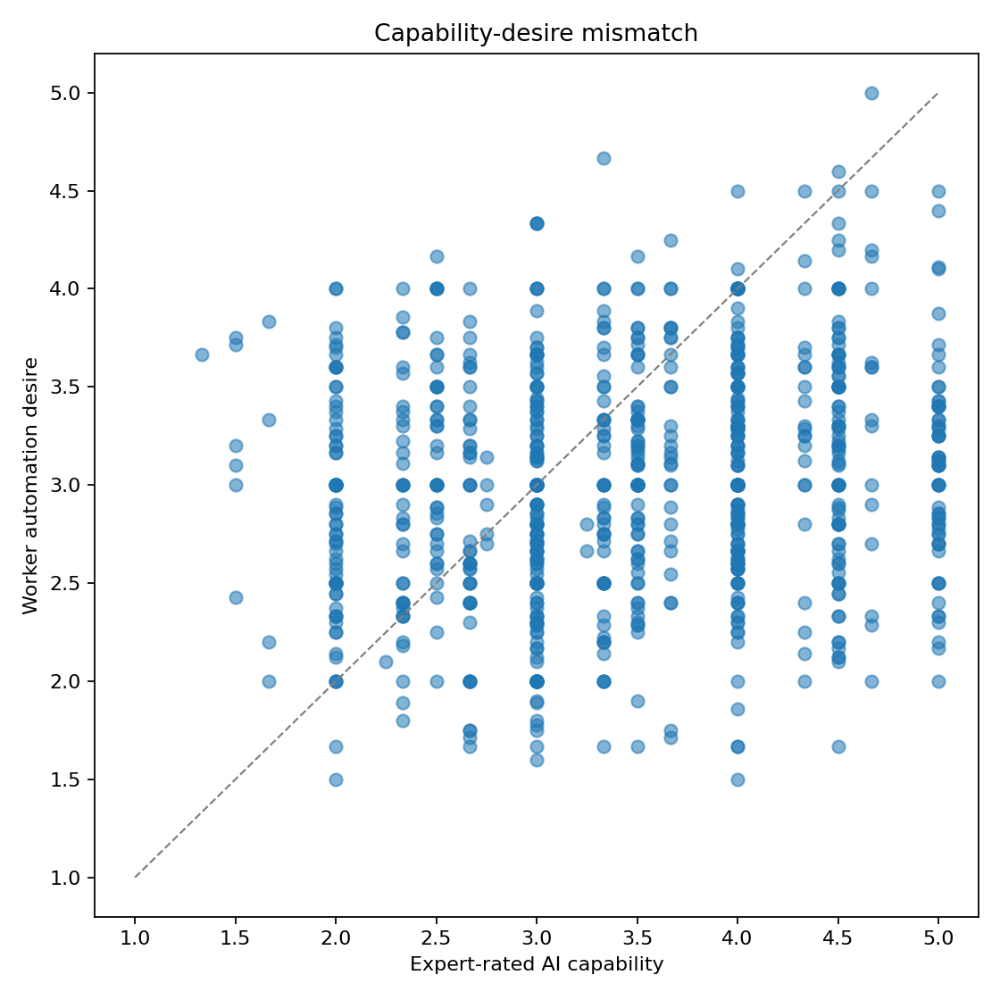
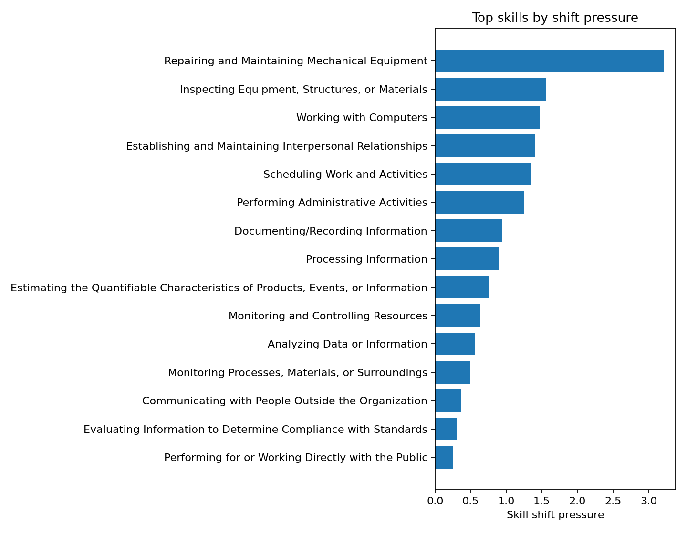

# Dashboard chuyển dịch kỹ năng khi có AI

Tài liệu tổng quan cho dự án phân tích tác động của AI lên task, kỹ năng, nghề, ngành và nhóm lao động.

---

## Mục lục

- [Tổng quan](#tong-quan)
- [Mục tiêu phân tích](#muc-tieu-phan-tich)
- [Sự chuyển dịch kỹ năng](#su-chuyen-dich-ky-nang)
- [Dữ liệu đầu vào và đầu ra](#du-lieu-dau-vao-va-dau-ra)
- [Cách phân tích](#cach-phan-tich)
- [Luồng hoạt động](#luong-hoat-dong)
- [Hình ảnh phân tích](#hinh-anh-phan-tich)

---

## Tổng quan

Dự án này xây dựng một dashboard Streamlit để trực quan hóa sự chuyển dịch kỹ năng lao động dưới tác động của AI. Trọng tâm không chỉ là xếp hạng task nào có thể bị tự động hóa, mà là nhận diện task/kỹ năng nào có khả năng đổi vai trò: từ tự làm sang giám sát, kiểm định, điều phối, chịu trách nhiệm hoặc phối hợp với AI.

Ứng dụng chính nằm trong `streamlit_app.py`. Pipeline phân tích và sinh dữ liệu tổng hợp nằm trong notebook `ai_skill_shift_research.ipynb`, còn các bảng kết quả đã xử lý nằm trong thư mục `outputs/`.

---

## Mục tiêu phân tích

Dự án trả lời bốn nhóm câu hỏi chính:

| Nhóm câu hỏi | Ý nghĩa |
| --- | --- |
| AI có thể tham gia task nào? | Đo mức độ task có tín hiệu tự động hóa hoặc hỗ trợ bởi AI |
| Người lao động muốn AI hỗ trợ ở đâu? | Nhận diện lực kéo từ nhu cầu thực tế của worker |
| Task nào vẫn cần con người? | Đo vai trò của chuyên môn miền, giao tiếp, phán đoán, đạo đức và kiểm soát chất lượng |
| Kỹ năng/nghề/ngành nào chịu áp lực chuyển dịch? | Tổng hợp tín hiệu ở cấp task thành ranking theo kỹ năng, nghề, ngành và nhóm worker |

Kết quả mong muốn là một bản đồ chuyển dịch kỹ năng:

- Task có thể tự động hóa nhiều hơn
- Task phù hợp với mô hình AI hỗ trợ con người
- Kỹ năng bền vững vì cần human agency cao
- Nhóm nghề/ngành cần ưu tiên reskilling
- Vùng lệch pha giữa năng lực AI và mong muốn của worker

---

## Sự chuyển dịch kỹ năng

Trong dự án này, **chuyển dịch kỹ năng** không được hiểu đơn giản là AI thay thế con người. Cách đọc chính là: khi AI tham gia vào một task, vai trò của kỹ năng con người có thể đổi từ trực tiếp thực hiện sang đặt mục tiêu, kiểm tra đầu ra, xử lý ngoại lệ, giải thích quyết định, phối hợp với người khác và chịu trách nhiệm cuối cùng.

Ví dụ, một kỹ năng như phân tích dữ liệu không nhất thiết biến mất. Nó có thể dịch từ việc tự xử lý bảng và vẽ biểu đồ sang việc đặt câu hỏi đúng, chọn dữ liệu phù hợp, kiểm định kết quả AI, phát hiện sai lệch và diễn giải insight cho người ra quyết định.

Các hướng chuyển dịch chính:

| Hướng chuyển dịch | Trước khi có AI | Sau khi AI tham gia | Hàm ý đào tạo lại |
| --- | --- | --- | --- |
| Tự động hóa một phần | Con người làm nhiều bước lặp lại | AI xử lý phần có cấu trúc, con người kiểm tra kết quả | Học cách đánh giá lỗi, đặt tiêu chí và kiểm soát chất lượng |
| AI hỗ trợ con người | Con người tự tìm, tổng hợp, soạn hoặc phân tích | AI tạo bản nháp/gợi ý, con người chọn lọc và chịu trách nhiệm | Học prompt, phản biện output và kết hợp domain knowledge |
| Nâng cấp kỹ năng con người | Kỹ năng nằm ở thao tác thực thi | Giá trị chuyển sang phán đoán, giao tiếp, đạo đức, xử lý ngoại lệ | Tập trung vào judgment, communication và accountability |
| Kỹ năng bền vững | Task phụ thuộc mạnh vào bối cảnh, con người hoặc vật lý | AI chỉ hỗ trợ gián tiếp hoặc chưa tác động rõ | Theo dõi tín hiệu mới, chưa vội kết luận thay thế |
| Lệch pha năng lực - mong muốn | Worker muốn hoặc không muốn AI làm thay | Năng lực AI và nhu cầu thực tế không khớp nhau | Xác định rào cản adoption: niềm tin, rủi ro, trách nhiệm hoặc UX |

Vì vậy, dashboard nên được đọc như bản đồ **tái cấu trúc kỹ năng**. `skill_shift_pressure` cao cho biết nơi kỹ năng có khả năng đổi cách làm mạnh hơn, còn `human_complementarity_index` cao nhắc rằng con người vẫn giữ vai trò quan trọng dù AI có thể hỗ trợ nhiều.

---

## Dữ liệu đầu vào và đầu ra

### Dữ liệu gốc

| File | Quy mô | Vai trò |
| --- | ---: | --- |
| `task_statement_with_metadata.csv` | 2,131 dòng | Task O*NET, nghề, tần suất, tầm quan trọng, wage/employment và nhóm kỹ năng |
| `domain_worker_desires.csv` | 5,731 dòng | Đánh giá của worker về mong muốn tự động hóa, human agency, enjoyment và job security |
| `domain_worker_metadata.csv` | 1,500 dòng | Metadata worker: nghề, tuổi, giới, thu nhập, học vấn, kinh nghiệm và mức quen thuộc với LLM |
| `expert_rated_technological_capability.csv` | 2,057 dòng | Đánh giá chuyên gia về năng lực AI, yêu cầu vật lý, bất định, chuyên môn và giao tiếp |
| `external_data/` | Nhiều bảng | Tín hiệu usage, paper, company, BLS và mapping O*NET |

### Dữ liệu đã xử lý

| File | Vai trò |
| --- | --- |
| `outputs/task_ai_skill_shift.csv` | Bảng task trung tâm, đã hợp nhất tín hiệu worker, expert, usage, paper, company và chỉ số tổng hợp |
| `outputs/skill_shift_summary.csv` | Tổng hợp theo kỹ năng |
| `outputs/reliable_skill_shift_summary.csv` | Ranking kỹ năng có đủ tín hiệu tin cậy hơn |
| `outputs/occupation_shift_summary.csv` | Tổng hợp theo nghề |
| `outputs/sector_shift_summary.csv` | Tổng hợp theo ngành |
| `outputs/worker_group_summary.csv` | Tổng hợp theo nhóm worker |
| `outputs/regression_*_shift.csv` | Kết quả mô hình khám phá theo nghề/ngành |
| `outputs/figures/*.png` | Hình tĩnh sinh từ pipeline |
| `outputs/initial_insights.md` | Báo cáo insight ban đầu từ pipeline |

---

## Cách phân tích

Pipeline phân tích dùng `task_statement_with_metadata.csv` làm bảng nền, sau đó nối thêm các tín hiệu bổ trợ:

1. Chuẩn hóa task và occupation để nối dữ liệu worker, expert, usage, paper, company và BLS.
2. Tính các điểm thành phần ở cấp task.
3. Chuẩn hóa và tổng hợp các điểm thành chỉ số phân tích.
4. Gắn nhãn loại chuyển dịch và loại lệch pha.
5. Tổng hợp từ task lên kỹ năng, nghề, ngành và nhóm worker.
6. Sinh bảng CSV, hình tĩnh và dashboard tương tác.

### Chỉ số chính

| Chỉ số | Cách hiểu |
| --- | --- |
| `automation_exposure_index` | AI có nhiều tín hiệu có thể tham gia vào task |
| `worker_pull_index` | Worker có xu hướng muốn AI hỗ trợ hoặc tự động hóa task |
| `human_complementarity_index` | Task vẫn cần con người vì chuyên môn, giao tiếp, phán đoán hoặc kiểm soát |
| `innovation_momentum_index` | Tín hiệu nghiên cứu và thương mại hóa quanh task/workflow |
| `skill_shift_pressure` | Áp lực chuyển dịch tổng hợp, cao khi exposure và worker pull cao nhưng complementarity thấp hơn |
| `exploratory_shift_score` | Điểm mô hình khám phá, dùng để chọn nơi cần xem sâu hơn |

### Nhãn diễn giải

| Nhãn | Ý nghĩa |
| --- | --- |
| `Automation candidate` | Task nghiêng về khả năng tự động hóa |
| `Worker-pulled automation` | Worker muốn AI hỗ trợ nhưng cần đọc thêm mức sẵn sàng kỹ thuật |
| `AI-augmented human premium` | AI có thể hỗ trợ, nhưng human complementarity vẫn cao |
| `Durable human skill` | Kỹ năng còn bền vì phụ thuộc nhiều vào con người |
| `Low near-term shift` | Tín hiệu chuyển dịch ngắn hạn chưa mạnh |
| `Insufficient signal` | Chưa đủ dữ liệu để diễn giải chắc |

---

## Luồng hoạt động

Sơ đồ dưới đây tách thành hai lớp: pipeline phân tích dữ liệu và quy trình Code Agent IDE. Cách tách này giúp đọc nhanh phần dashboard, đồng thời thấy rõ Code Agent IDE đang nhận repo, lập index nhẹ, ghép context và trả lời ra sao.

### Quy trình Code Agent IDE

Chế độ `Code Agent IDE` là một prototype mô phỏng agent trong IDE. Người dùng nạp repo zip hoặc dùng demo repo có sẵn, app trích xuất file và symbol, sau đó trả lời câu hỏi bằng LLM nếu có API key hoặc fallback local nếu chưa cấu hình AI.

```mermaid
flowchart TB
    accTitle: Quy Trinh Code Agent IDE
    accDescr: Code Agent IDE nhan repo, tao bang file va symbol, ghep context theo cau hoi, ap dung thanh kiem soat, roi tra loi bang LLM hoac fallback local kem tool trace.

    open_mode([Chon Code Agent IDE]) --> choose_repo{Dung repo nao?}

    choose_repo -->|Demo| demo_repo[Load demo repo]
    choose_repo -->|Upload zip| parse_zip[Parse zip repo]
    parse_zip --> zip_valid{Zip hop le?}
    zip_valid -->|Khong| show_error[Bao loi file bi bo qua]
    zip_valid -->|Co| repo_files[(Repo files)]
    demo_repo --> repo_files

    repo_files --> build_symbols[Trich xuat symbol]
    build_symbols --> symbol_table[(Symbol table)]
    repo_files --> file_picker[Chon file dang mo]
    symbol_table --> file_picker

    file_picker --> ask_question[Nhap cau hoi agent]
    ask_question --> controls[Doc thanh kiem soat]

    subgraph controls_group ["Thanh kiem soat"]
        strictness[GitHub strictness]
        risk[Action risk]
        review[Human review]
        autonomy[Autonomy]
    end

    controls_group --> controls
    controls --> local_analysis[Phan tich local]
    local_analysis --> trace_start[Khoi tao tool trace]
    local_analysis --> match_symbol{Co symbol lien quan?}

    match_symbol -->|Co| find_refs[Tim references]
    match_symbol -->|Khong| extract_outline[Lay outline file]
    find_refs --> fallback_answer[Soan fallback answer]
    extract_outline --> fallback_answer

    fallback_answer --> ai_config{AI da cau hinh?}
    ai_config -->|Khong| final_fallback[Tra loi fallback]
    ai_config -->|Co| build_context[Ghep repo context]
    build_context --> call_llm[Goi OpenAI compatible API]
    call_llm --> llm_ok{Goi thanh cong?}
    llm_ok -->|Co| final_ai[Tra loi bang LLM]
    llm_ok -->|Loi| final_fallback

    final_ai --> show_result[Hien thi ket qua va trace]
    final_fallback --> show_result
    show_error --> show_result

    classDef input fill:#f3f4f6,stroke:#6b7280,stroke-width:2px,color:#1f2937
    classDef process fill:#dbeafe,stroke:#2563eb,stroke-width:2px,color:#1e3a5f
    classDef data fill:#dcfce7,stroke:#16a34a,stroke-width:2px,color:#14532d
    classDef decision fill:#fef9c3,stroke:#ca8a04,stroke-width:2px,color:#713f12
    classDef output fill:#ede9fe,stroke:#7c3aed,stroke-width:2px,color:#3b0764

    class open_mode,demo_repo,parse_zip,ask_question,strictness,risk,review,autonomy input
    class build_symbols,file_picker,controls,local_analysis,trace_start,find_refs,extract_outline,fallback_answer,build_context,call_llm process
    class repo_files,symbol_table data
    class choose_repo,zip_valid,match_symbol,ai_config,llm_ok decision
    class show_error,final_fallback,final_ai,show_result output
```

---

## Hình ảnh phân tích

Các hình dưới đây là ảnh tĩnh sinh từ pipeline trong `outputs/figures/`. Chúng giúp đọc nhanh các pattern chính trước khi mở dashboard tương tác.

*Figure 1: Quadrant task đặt `automation_exposure_index` trên trục X và `human_complementarity_index` trên trục Y để tách vùng tự động hóa, AI hỗ trợ con người và kỹ năng bền vững.*

*Figure 2: Capability-desire mismatch cho thấy nơi AI có năng lực nhưng worker ít muốn giao, hoặc nơi worker muốn hỗ trợ nhưng công nghệ chưa thật sự sẵn sàng.*

*Figure 3: Top skill shift pressure xếp hạng các kỹ năng có áp lực chuyển dịch cao, hữu ích để chọn ưu tiên reskilling và phân tích sâu.*
