# Phân tích và khuyến nghị AI Agent trong ngành khoa học máy tính

## 1. Trọng tâm đề tài

Đề tài phân tích **sự dịch chuyển kỹ năng** trong nhóm ngành *Computer and Mathematical* khi AI Agent tham gia vào công việc lập trình.

Luận điểm chính:

> AI có thể làm tăng tốc độ tạo output kỹ thuật, đặc biệt là code và tài liệu, nhưng chất lượng không tự động được đảm bảo. Vì vậy kỹ năng của lập trình viên dịch chuyển từ “tự viết code” sang “định hướng AI, kiểm thử, review, kiểm soát rủi ro và chịu trách nhiệm chất lượng”.

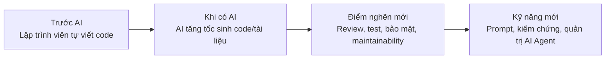

## 2. Dữ liệu và phạm vi

Phân tích tập trung vào subset **Computer and Mathematical**:

- **261 task**
- **29 nghề**
- **5 nhóm task**
- **51.0% task critical về chất lượng**
- **40 task** được khuyến nghị ở mức **Copilot + review bắt buộc**

Các file chính:

- `outputs/task_ai_skill_shift.csv`: dữ liệu task gốc.
- `outputs/cs_agent_task_recommendations.csv`: khuyến nghị AI Agent theo task.
- `outputs/cs_reskilling_priority_by_task.csv`: ưu tiên reskilling theo task.
- `outputs/cs_regression_quality_risk_ols.csv`: hồi quy rủi ro chất lượng.
- `outputs/cs_skill_shift_pathway.csv`: pathway dịch chuyển kỹ năng.
- `streamlit_app.py`: dashboard trực quan 3 tab.
- `src/repo_agent/`: core repo-aware AI Agent prototype.
- `docs/repo_agent_architecture.md`: mô tả kiến trúc Tab 3.

## 3. Quy trình phân tích

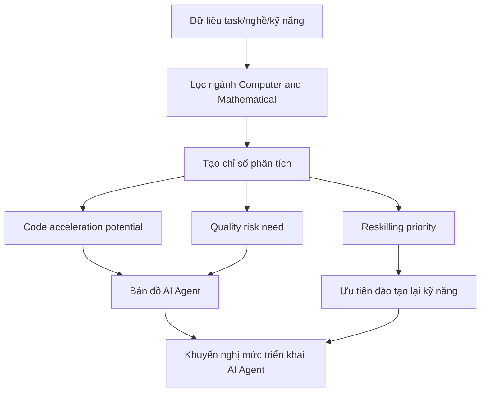

Các chỉ số chính:

- `code_acceleration_potential`: khả năng AI giúp tăng tốc tạo output/code.
- `quality_risk_need`: mức cần kiểm soát chất lượng, review, test, domain expertise.
- `agent_recommendation`: mức khuyến nghị triển khai AI Agent.
- `reskilling_priority_score`: mức ưu tiên nâng cấp kỹ năng.

## 4. Insight chính

1. **AI phù hợp để tăng tốc output, không phù hợp để tự quyết chất lượng.**  
   Những task sinh code, viết tài liệu, tạo báo cáo có tiềm năng tăng tốc cao, nhưng các task review, troubleshooting, QA, kiến trúc, bảo mật vẫn cần con người kiểm soát.

2. **Điểm nghẽn dịch chuyển từ viết code sang kiểm định code.**  
   Khi AI sinh code nhanh hơn, kỹ năng quan trọng hơn là review logic, viết test, kiểm tra edge case, đánh giá maintainability và ra quyết định merge/deploy.

3. **Không nên triển khai AI Agent một mức cho mọi task.**  
   Task rủi ro thấp có thể dùng agent bán tự động; task critical nên dùng Copilot + review hoặc human-led AI assistance.

4. **Nhóm nghề ưu tiên reskilling cao nhất** gồm:
   - Computer Systems Engineers/Architects
   - Computer and Information Research Scientists
   - Information Technology Project Managers
   - Clinical Data Managers
   - Business Intelligence Analysts

## 5. Khuyến nghị AI Agent

### 5.1. Mức triển khai theo rủi ro task

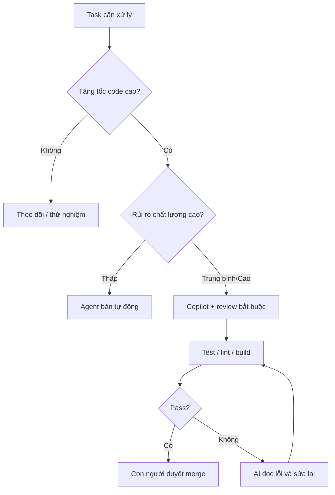

### 5.2. Bốn mức kiểm soát AI Agent

| Mức | Tên | AI được làm | Con người giữ quyền |
|---|---|---|---|
| 1 | Gợi ý | Giải thích, checklist, đề xuất test | Tự sửa code và ra quyết định |
| 2 | Copilot có review | Viết nháp code/test theo repo context | Review diff, duyệt merge |
| 3 | Agent bán tự động | Sửa phạm vi nhỏ, chạy test/lint/build | Duyệt cuối |
| 4 | Tự động có giám sát | Tự xử lý task lặp lại, tạo PR | Audit, policy, rollback |

## 6. Khuyến nghị cá nhân hóa AI Agent theo repository

Không nên fine-tune model ngay cho từng repo. Cách phù hợp hơn là:

> **RAG + phân tích codebase + prompt context + kiểm thử tự động**

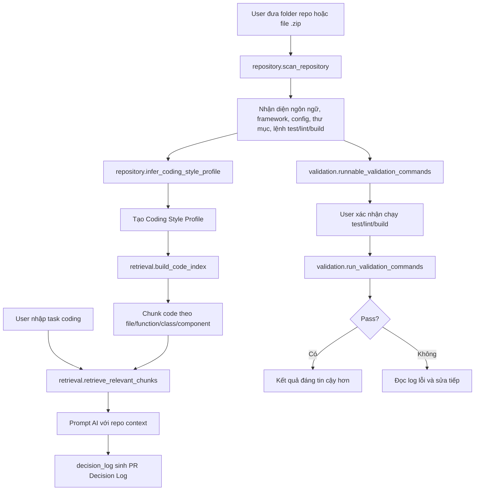

Tab 3 trong Streamlit đã triển khai prototype luồng này:

- Upload repo dạng `.zip` hoặc nhập path folder.
- Quét repo và nhận diện framework/config.
- Rút coding style profile từ code.
- Chunk code và retrieve đoạn liên quan theo task bằng token/code search.
- Sinh PR Decision Log bằng AI từ key trong `.env`.
- Cho phép chạy validation thật nếu người dùng xác nhận.

## 7. Dashboard Streamlit

Chạy dashboard:

```bash
streamlit run streamlit_app.py
```

Dashboard gồm 3 tab:

- **Tab 1:** AI, output code và chất lượng.
- **Tab 2:** Dịch chuyển kỹ năng và reskilling.
- **Tab 3:** Cá nhân hóa AI Agent theo repository.

## 8. Hình ảnh minh chứng

Các hình được tạo trong `outputs/figures/`:

**Hình 1. So sánh tín hiệu theo nhóm task**  
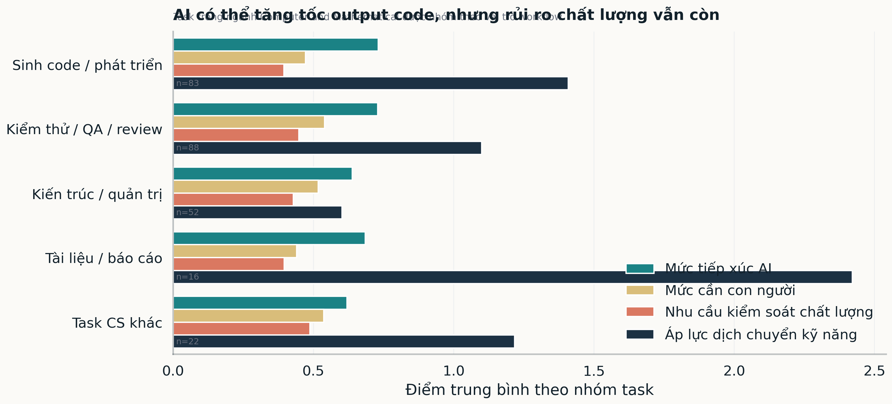

**Hình 2. Bản đồ AI Agent: tăng tốc code so với rủi ro chất lượng**  
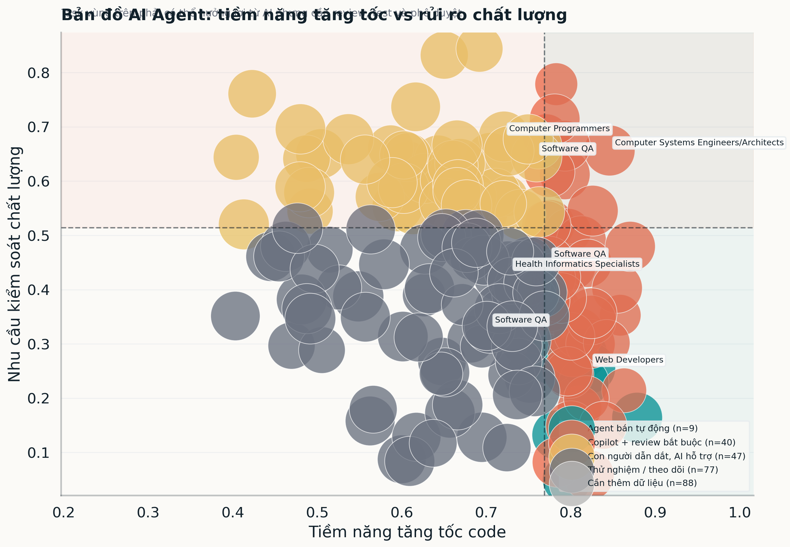

**Hình 3. So sánh nghề theo tín hiệu dịch chuyển kỹ năng**  
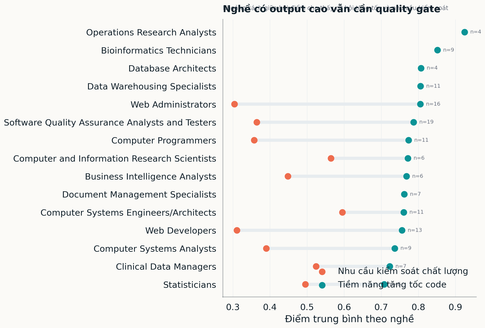

**Hình 4. Thành phần loại dịch chuyển kỹ năng**  
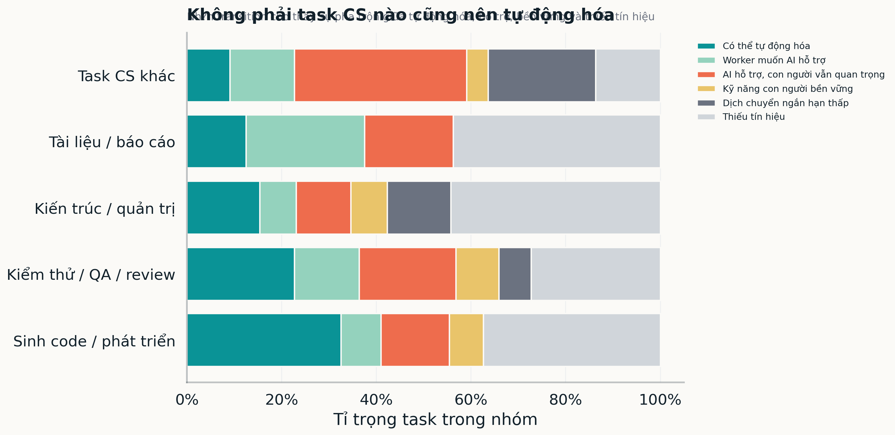

**Hình 5. PCA map cho sự dịch chuyển kỹ năng**  
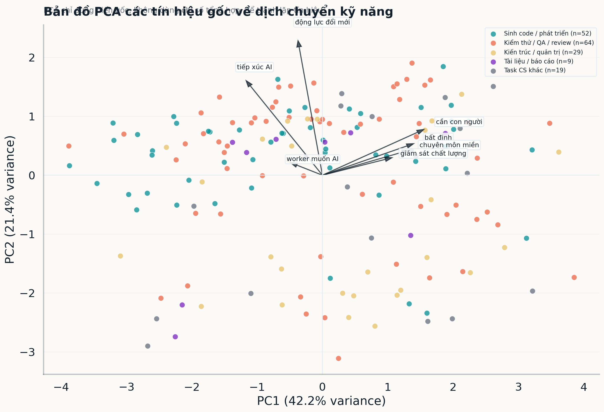

**Hình 6. Tương quan giữa các chỉ số phân tích**  
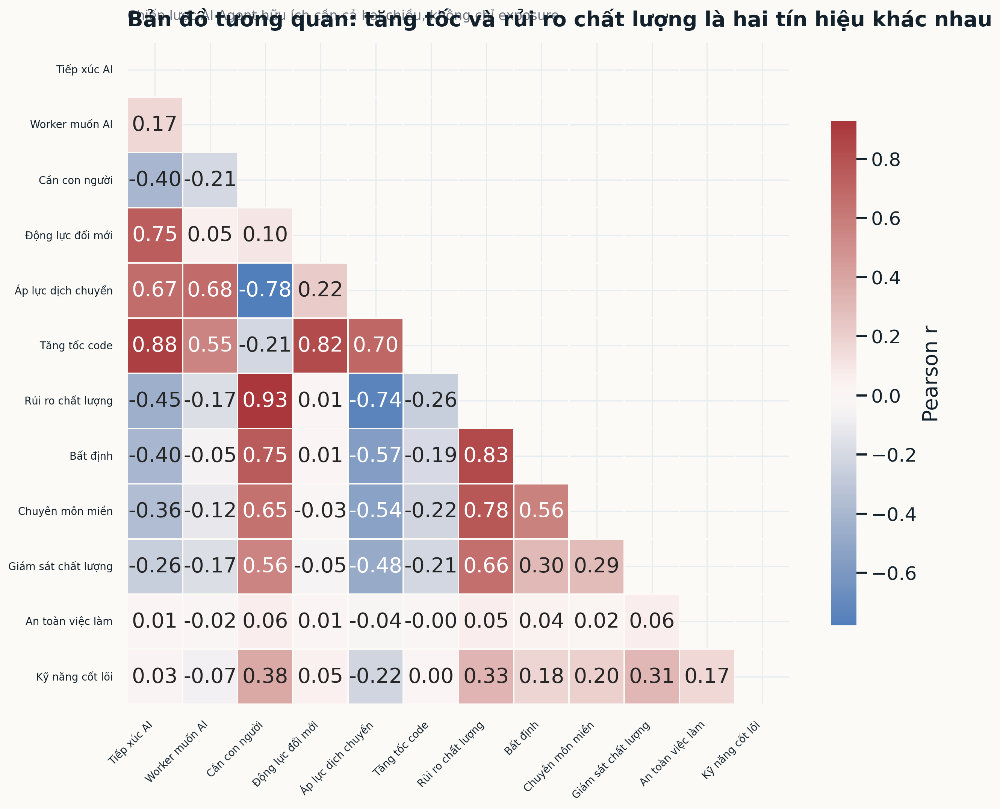

**Hình 7. Phân bổ khuyến nghị AI Agent**  
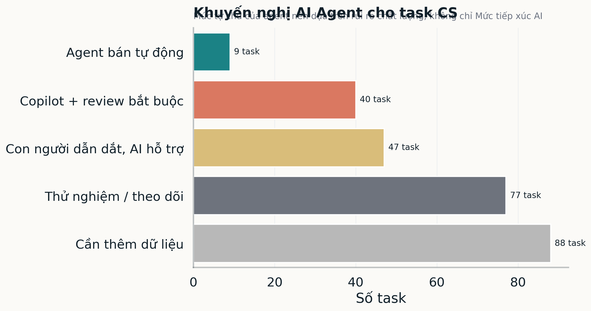

**Hình 8. Hồi quy khám phá các yếu tố liên quan quality gate**  
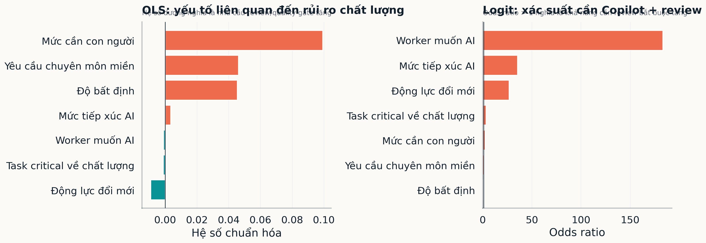

**Hình 9. Pathway dịch chuyển kỹ năng**  
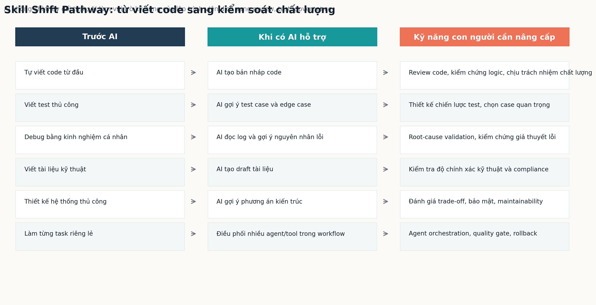

**Hình 10. Ưu tiên reskilling theo nghề/task**  
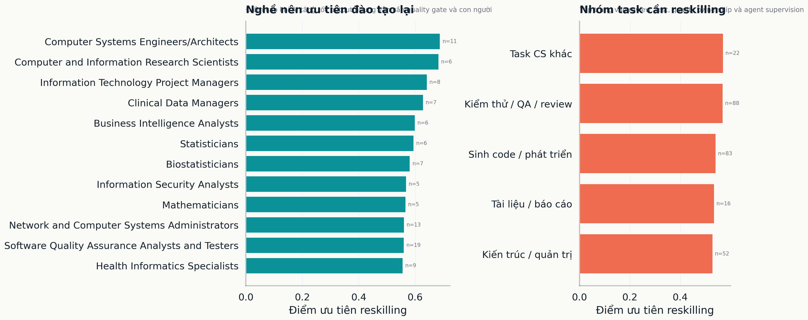

## 9. Kết luận ngắn

AI Agent không chỉ là công cụ “viết code nhanh hơn”. Trong ngành khoa học máy tính, tác động quan trọng hơn là làm thay đổi vai trò kỹ năng: lập trình viên cần chuyển từ trực tiếp tạo output sang thiết kế yêu cầu, kiểm chứng output, quản trị chất lượng và kiểm soát mức tự động hóa của AI.
