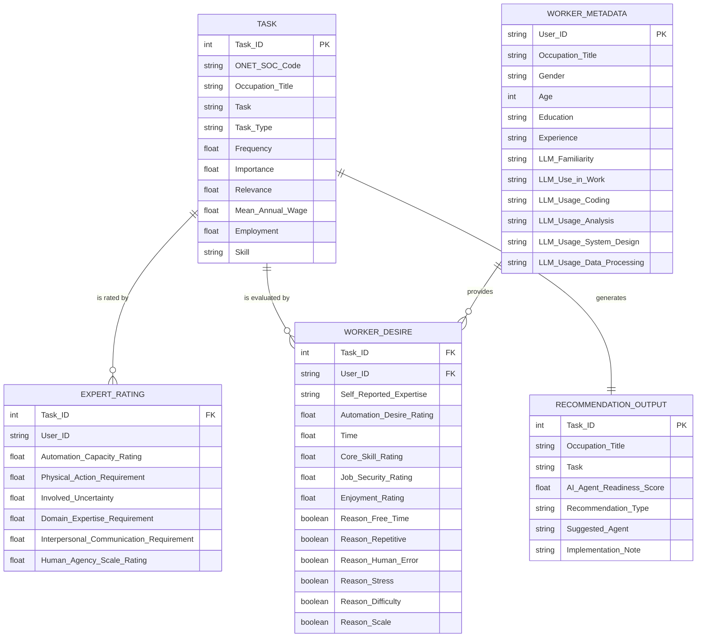
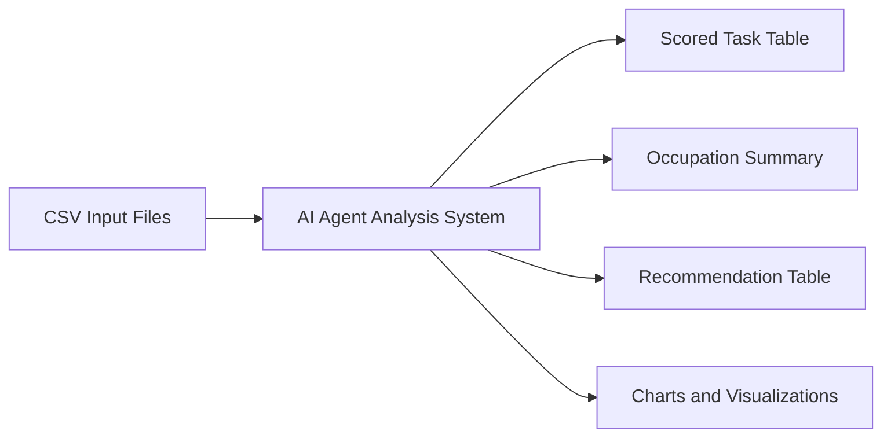
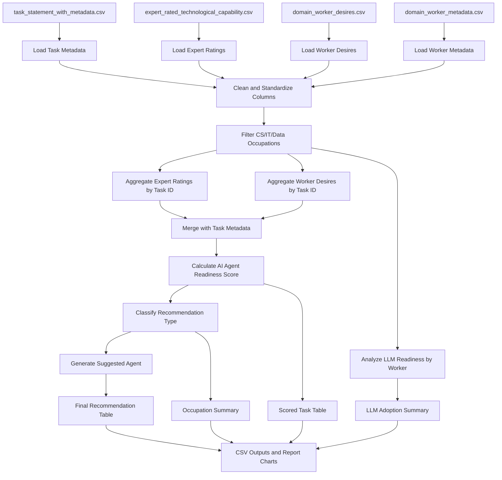
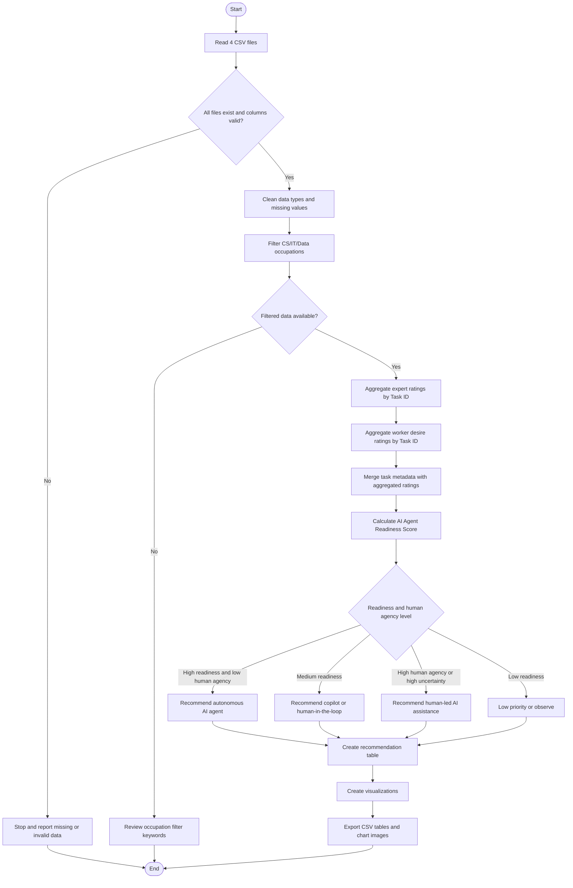

# Tài liệu mô tả luồng xử lý phân tích và khuyến nghị AI Agent trong ngành Khoa học máy tính

## 1. Mục tiêu hệ thống

Hệ thống phân tích dữ liệu từ 4 file CSV để xác định các tác vụ trong ngành Khoa học máy tính, Công nghệ thông tin, Phần mềm và Dữ liệu có mức độ phù hợp cao để triển khai AI agent.

Mục tiêu đầu ra gồm:

- Xác định các nghề và tác vụ liên quan đến ngành Khoa học máy tính.
- Đánh giá mức độ sẵn sàng tự động hóa của từng tác vụ.
- Phân loại tác vụ theo mức khuyến nghị: agent tự động, copilot có con người phê duyệt, hoặc chỉ hỗ trợ con người.
- Tạo bảng và biểu đồ phục vụ báo cáo phân tích.

## 2. Nguồn dữ liệu đầu vào

Hệ thống sử dụng 4 bảng dữ liệu chính:

| File | Vai trò |
|---|---|
| `task_statement_with_metadata.csv` | Chứa thông tin tác vụ O*NET, nghề, mức quan trọng, mức liên quan, lương và số lượng lao động |
| `expert_rated_technological_capability.csv` | Chứa đánh giá của chuyên gia về khả năng tự động hóa, mức cần con người, độ bất định, yêu cầu chuyên môn |
| `domain_worker_desires.csv` | Chứa đánh giá của người lao động về mong muốn tự động hóa và lý do muốn hoặc không muốn tự động hóa |
| `domain_worker_metadata.csv` | Chứa hồ sơ người lao động, mức độ quen thuộc với LLM và tần suất sử dụng LLM trong công việc |

## 3. ERD - Entity Relationship Diagram

### 3.1. Các thực thể chính

**Task**

Đại diện cho một tác vụ nghề nghiệp trong O*NET.

Thuộc tính chính:

- `Task ID`
- `O*NET-SOC Code`
- `Occupation (O*NET-SOC Title)`
- `Task`
- `Task Type`
- `Frequency`
- `Importance`
- `Relevance`
- `Occupation Mean Annual Wage`
- `Occupation Employment`
- `Skill (O*NET Work Activity)`

**Expert Rating**

Đại diện cho đánh giá của chuyên gia đối với một tác vụ.

Thuộc tính chính:

- `Task ID`
- `User ID`
- `Automation Capacity Rating`
- `Physical Action Requirement`
- `Involved Uncertainty`
- `Domain Expertise Requirement`
- `Interpersonal Communication Requirement`
- `Human Agency Scale Rating`

**Worker Desire**

Đại diện cho đánh giá của người lao động về mong muốn tự động hóa một tác vụ.

Thuộc tính chính:

- `Task ID`
- `User ID`
- `Self-reported Expertise`
- `Automation Desire Rating`
- `Time`
- `Core Skill Rating`
- `Job Security Rating`
- `Enjoyment Rating`
- Các cột lý do muốn tự động hóa
- Các cột lý do cần con người tham gia

**Worker Metadata**

Đại diện cho thông tin nền của người lao động.

Thuộc tính chính:

- `User ID`
- `Occupation (O*NET-SOC Title)`
- `Gender`
- `Age`
- `Education`
- `Experience`
- `LLM Familiarity`
- `LLM Use in Work`
- `LLM Usage by Type - Coding`
- `LLM Usage by Type - Analysis`
- `LLM Usage by Type - System Design`
- `LLM Usage by Type - Data Processing`

**Recommendation Output**

Đại diện cho bảng kết quả sau phân tích.

Thuộc tính chính:

- `Task ID`
- `Occupation`
- `Task`
- `AI Agent Readiness Score`
- `Recommendation Type`
- `Suggested Agent`
- `Implementation Note`

### 3.2. Quan hệ giữa các thực thể

| Quan hệ | Mô tả |
|---|---|
| `Task` 1 - N `Expert Rating` | Một tác vụ có thể được nhiều chuyên gia đánh giá |
| `Task` 1 - N `Worker Desire` | Một tác vụ có thể được nhiều người lao động đánh giá |
| `Worker Metadata` 1 - N `Worker Desire` | Một người lao động có thể đánh giá nhiều tác vụ |
| `Task` 1 - 1 `Recommendation Output` | Sau khi tổng hợp, mỗi tác vụ có một dòng khuyến nghị |

### 3.3. ERD bằng Mermaid



## 4. Data Flow Diagram

## 4.1. DFD Level 0 - Tổng quan hệ thống

Ở mức tổng quan, hệ thống nhận 4 nguồn dữ liệu CSV, xử lý phân tích, sau đó xuất ra bảng điểm, biểu đồ và khuyến nghị AI agent.



## 4.2. DFD Level 1 - Luồng xử lý chi tiết



## 5. Flowchart xử lý phân tích

Flowchart mô tả trình tự xử lý từ khi đọc dữ liệu đến khi tạo khuyến nghị.



## 6. Logic tính điểm AI Agent Readiness

Chỉ số `AI Agent Readiness Score` được dùng để xếp hạng mức độ phù hợp của từng tác vụ với AI agent.

Công thức đề xuất:

```text
AI Agent Readiness =
0.30 * Automation Capacity
+ 0.20 * Automation Desire
+ 0.15 * (6 - Human Agency)
+ 0.10 * (6 - Physical Requirement)
+ 0.10 * (6 - Interpersonal Requirement)
+ 0.10 * (6 - Uncertainty)
+ 0.05 * Task Importance
```

Ý nghĩa các thành phần:

| Thành phần | Ý nghĩa |
|---|---|
| `Automation Capacity` | Chuyên gia đánh giá công nghệ có thể tự động hóa tác vụ đến mức nào |
| `Automation Desire` | Người lao động có muốn tác vụ được tự động hóa hay không |
| `6 - Human Agency` | Tác vụ càng ít cần quyền quyết định của con người thì điểm càng cao |
| `6 - Physical Requirement` | Tác vụ càng ít yêu cầu hành động vật lý thì càng phù hợp với AI agent |
| `6 - Interpersonal Requirement` | Tác vụ càng ít yêu cầu giao tiếp con người thì càng dễ tự động hóa |
| `6 - Uncertainty` | Tác vụ càng ít bất định thì càng dễ để agent xử lý |
| `Task Importance` | Tác vụ càng quan trọng thì càng đáng ưu tiên triển khai nếu khả thi |

## 7. Quy tắc phân loại khuyến nghị

| Điều kiện | Loại khuyến nghị | Diễn giải |
|---|---|---|
| Readiness >= 4.0 và Human Agency <= 2.5 | Autonomous agent candidate | Có thể triển khai agent tự động ở mức cao, cần logging và cơ chế rollback |
| Readiness >= 3.3 và Human Agency <= 3.3 | Copilot / human-in-the-loop | Agent đề xuất, con người kiểm tra và phê duyệt |
| Human Agency > 3.3 hoặc Domain Expertise >= 3.8 hoặc Uncertainty >= 3.5 | Human-led with AI assistance | AI chỉ hỗ trợ tổng hợp, phân tích sơ bộ, checklist hoặc nhắc việc |
| Các trường hợp còn lại | Low priority / observe | Chưa nên ưu tiên tự động hóa |

## 8. Mapping từ loại tác vụ sang loại AI agent

| Nhóm tác vụ | Loại AI agent phù hợp | Ví dụ |
|---|---|---|
| Backup, recovery, record keeping, documentation | Operations automation agent | Backup dữ liệu, ghi nhận sự cố, cập nhật tài liệu |
| Monitoring, server, network, security, virus protection | IT monitoring and support agent | Theo dõi server, phân tích log, cảnh báo bất thường |
| Testing, QA, defect tracking, compatibility testing | QA testing agent | Ghi nhận bug, tạo test case, phân loại lỗi |
| Data analysis, statistical report, chart generation | Data analysis / reporting agent | Tạo báo cáo, biểu đồ, phân tích dữ liệu |
| Project planning, architecture, risk assessment, system design | Technical copilot with human approval | Đề xuất phương án, đánh giá rủi ro, hỗ trợ ra quyết định |

## 9. Output của quy trình

Sau khi chạy notebook, hệ thống tạo các đầu ra:

| Output | Mục đích |
|---|---|
| `ai_agent_task_scored.csv` | Bảng toàn bộ task đã được tính điểm readiness |
| `ai_agent_occupation_summary.csv` | Bảng tổng hợp theo nghề |
| `ai_agent_recommendations.csv` | Bảng khuyến nghị AI agent theo từng task |
| `readiness_by_occupation.png` | Biểu đồ readiness theo nghề |
| `automation_vs_human_agency.png` | Biểu đồ quan hệ giữa khả năng tự động hóa và mức cần con người |
| `worker_reason_rates.png` | Biểu đồ lý do worker muốn tự động hóa hoặc cần con người |
| `llm_usage_by_type.png` | Biểu đồ mức sử dụng LLM theo loại tác vụ |

## 10. Kết luận thiết kế

Luồng xử lý này phù hợp với chủ đề phân tích và khuyến nghị AI agent vì kết hợp được 3 góc nhìn:

- **Góc nhìn công nghệ:** chuyên gia đánh giá khả năng tự động hóa.
- **Góc nhìn người lao động:** worker có muốn tự động hóa hay không và vì sao.
- **Góc nhìn tác vụ nghề nghiệp:** task có quan trọng, phổ biến và liên quan đến ngành CS/IT/Data hay không.

Với ngành Khoa học máy tính, các tác vụ nên ưu tiên triển khai AI agent trước là những tác vụ có tính lặp lại, dữ liệu rõ ràng, ít yêu cầu giao tiếp và ít cần phán đoán đạo đức hoặc chiến lược. Các tác vụ liên quan đến kiến trúc hệ thống, bảo mật, quản lý dự án và quyết định kỹ thuật nên triển khai ở dạng copilot có con người phê duyệt.
