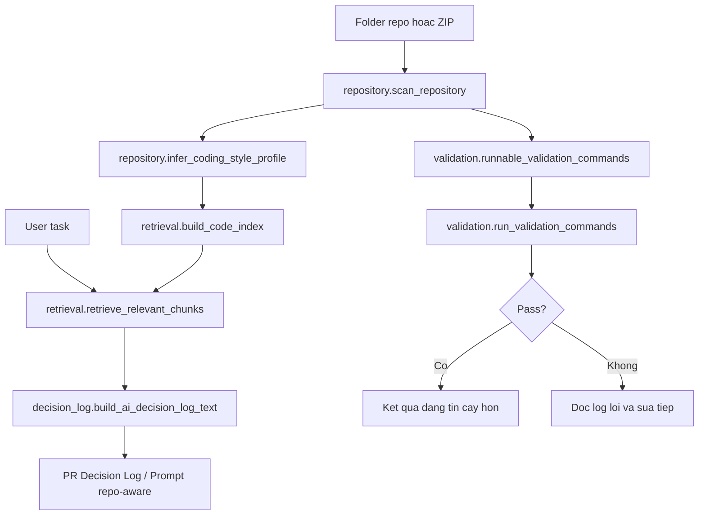

# Kien truc Repo-aware AI Agent

Tai lieu nay mo ta phan Tab 3 trong Streamlit sau khi tach logic khoi giao dien.

## Muc tieu

He thong minh hoa cach ca nhan hoa AI coding agent theo tung repository:

1. Nhan repo tu folder local hoac file `.zip`.
2. Quet cau truc, framework, config va lenh `test/lint/build`.
3. Rut coding style profile tu code hien co.
4. Chunk code theo file/function/class/component.
5. Retrieve cac chunk lien quan den task nguoi dung.
6. Tao prompt/PR Decision Log dua tren context retrieve duoc.
7. Chi tin ket qua sau khi di qua validation gate `test/lint/build`.

## Cau truc file

```text
streamlit_app.py
src/
  repo_agent/
    __init__.py
    config.py
    repository.py
    retrieval.py
    validation.py
    decision_log.py
docs/
  repo_agent_architecture.md
```

## Trach nhiem module

- `streamlit_app.py`: render dashboard, nhan input nguoi dung, hien thi repo profile, prompt, retrieved chunks va ket qua validation.
- `src/repo_agent/config.py`: cau hinh chung cho scanner nhu file suffix, ngon ngu va thu muc can bo qua.
- `src/repo_agent/repository.py`: giai nen repo, quet file, nhan dien framework/config, rut tin hieu coding style.
- `src/repo_agent/retrieval.py`: chunk code va retrieve context lien quan theo task.
- `src/repo_agent/validation.py`: gom va chay lenh validation `test/lint/build`.
- `src/repo_agent/decision_log.py`: tao fallback Decision Log hoac goi LLM de sinh Decision Log tu repo context.

## Luong xu ly



## Ranh gioi hien tai

Day la prototype co RAG/code-search muc ung dung. Retrieval hien tai dung token scoring tren path, symbol va content; chua dung vector database nhu FAISS/Chroma. Phan validation co the chay lenh that sau khi nguoi dung xac nhan trong Streamlit.
