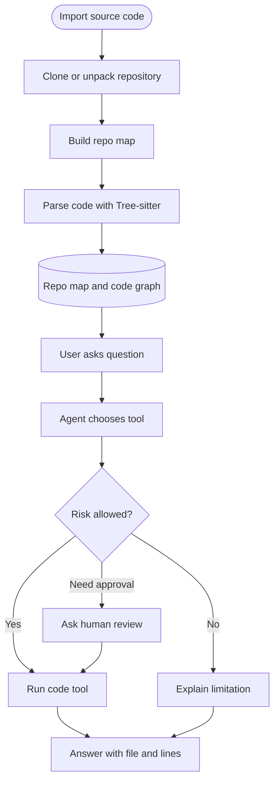
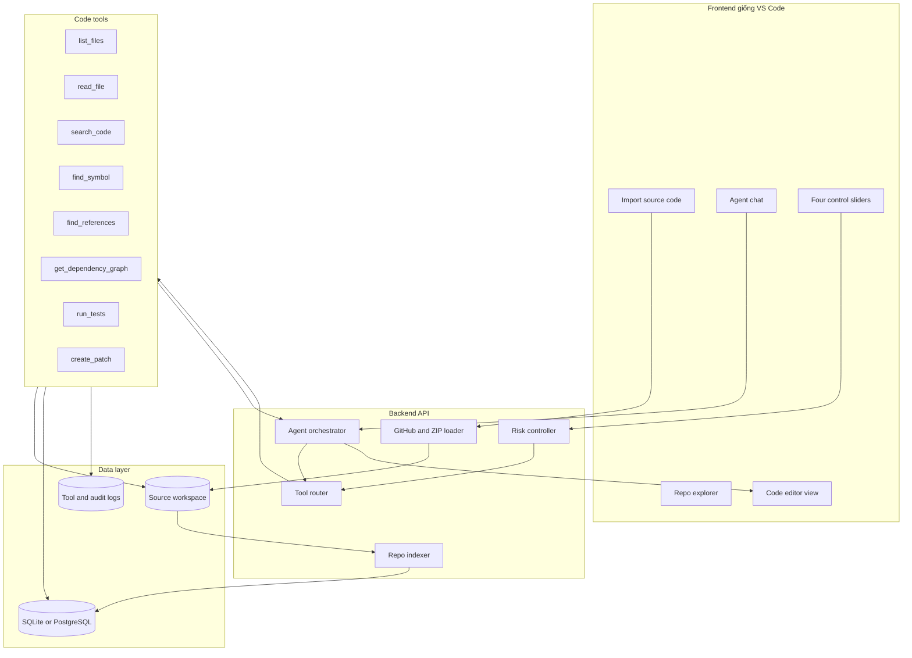

# Kế hoạch sản phẩm Tool-based Code Agent giao diện kiểu VS Code

_Mục tiêu: thiết kế một ứng dụng AI Agent đọc source code bằng tool, không dùng vector database, embedding hay RAG thuần._

---

## Mục tiêu cuối

Sản phẩm cuối là một giao diện giống Visual Studio Code, trong đó người dùng có thể import source code vào làm tri thức cho AI Agent. AI không trả lời bằng cách tìm đoạn văn gần nghĩa trong vector database, mà tự dùng công cụ để đọc repo như một lập trình viên: xem cây thư mục, đọc file, tìm symbol, lần theo references, xem dependency graph, rồi trả lời kèm file và dòng liên quan.

Điểm quan trọng của sản phẩm là người dùng không chỉ chat với AI, mà còn kiểm soát mức tự chủ của AI bằng 4 thanh điều khiển ở cạnh giao diện. Các thanh này không chỉ đổi prompt; chúng quyết định AI được phép đọc gì, suy luận đến đâu, có được tạo patch không, và khi nào cần con người duyệt.

## Tầm nhìn giao diện

Giao diện nên tạo cảm giác như một IDE có AI Agent gắn bên trong:

| Khu vực | Vai trò | Nội dung chính |
| --- | --- | --- |
| **Sidebar trái** | Điều hướng repo | File explorer, symbol outline, dependency view |
| **Editor trung tâm** | Xem tri thức/code | Source file, đoạn code Agent trích dẫn, diff/patch preview |
| **Panel phải** | Kiểm soát AI | 4 thanh tự chủ/kiểm soát, trạng thái risk, log tool calls |
| **Panel dưới** | Trao đổi với Agent | Chat, câu trả lời, nguồn file/dòng, test output |
| **Ô import source** | Nạp tri thức | GitHub URL, upload ZIP, chọn folder local, trạng thái indexing |

### Bố cục màn hình đề xuất

```text
+------------------------------------------------------------------------------+
| Top bar: project name | repo status | indexing status | run/test buttons     |
+---------------+------------------------------------------+-------------------+
| Repo Explorer | Editor / Code Knowledge View             | AI Control Panel  |
|               |                                          |                   |
| - files       | - selected source file                   | GitHub Strictness |
| - symbols     | - symbol detail                          | Action Risk       |
| - routes      | - references                             | Human Review      |
| - graph       | - patch preview                          | Autonomy          |
+---------------+------------------------------------------+-------------------+
| Agent chat: ask question | tool trace | answer with sources | next actions     |
+------------------------------------------------------------------------------+
```

## Luồng người dùng

1. Người dùng mở ứng dụng.
2. Người dùng import source code bằng một trong ba cách: GitHub URL, upload ZIP, hoặc chọn folder local.
3. Backend clone/giải nén/copy repo vào workspace tạm.
4. Repo Indexer quét cây thư mục, danh sách file, imports, functions, classes, routes, test files.
5. Tree-sitter phân tích code thành syntax tree để lấy symbol chính xác. Tree-sitter phù hợp cho hướng này vì nó là parser generator và incremental parsing library cho source code.[^1]
6. Hệ thống lưu repo map và code graph vào SQLite/PostgreSQL.
7. Người dùng hỏi trong chat.
8. AI Agent nhìn repo map và tự chọn tool cần gọi.
9. Risk Controller đọc 4 thanh kiểm soát để quyết định tool nào được phép chạy.
10. Agent trả lời kèm file, dòng, symbol và mức tự tin.



## Kiến trúc hệ thống

Hệ thống nên xây theo hướng Tool-based Code Agent, không dùng vector database trong MVP. Dữ liệu chính là cấu trúc repo: file tree, symbol table, references, dependency graph, test commands và patch history.



## Thành phần chính

### Frontend

Frontend nên ưu tiên trải nghiệm IDE hơn là chatbot thông thường.

| Thành phần | Chức năng | Ghi chú thiết kế |
| --- | --- | --- |
| **Import source box** | Nhập GitHub URL, upload ZIP, chọn folder local | Đây là cổng nạp tri thức chính |
| **Repo explorer** | Hiện cây thư mục, filter file, trạng thái đã index | Tương tự sidebar VS Code |
| **Symbol outline** | Hiện function/class/route trong file đang chọn | Click symbol để mở đúng dòng |
| **Editor view** | Xem code, highlight dòng AI trích dẫn | Không cần edit ở MVP đầu tiên |
| **Agent chat** | Hỏi đáp về repo, refactor, bug, impact analysis | Câu trả lời luôn có nguồn |
| **Tool trace** | Hiện Agent đã gọi tool nào | Tăng niềm tin và debug dễ hơn |
| **Risk sliders** | Điều khiển quyền hành động của Agent | 4 thanh nằm bên phải |
| **Patch preview** | Xem diff nếu Agent được phép tạo patch | Không tự apply nếu chưa duyệt |

### Backend

| Module | Nhiệm vụ |
| --- | --- |
| **Repo Loader** | Clone GitHub repo, nhận ZIP, chuẩn hóa workspace |
| **Repo Indexer** | Tạo file tree, lọc file lớn/binary/vendor, phát hiện ngôn ngữ |
| **Tree-sitter Parser** | Trích xuất functions, classes, imports, routes, call sites |
| **Code Graph Builder** | Lưu quan hệ file import, symbol reference, route-service-database |
| **Tool Layer** | Cung cấp tool an toàn cho Agent gọi |
| **Risk Controller** | Kiểm tra 4 thanh trước khi cho tool chạy |
| **Agent Orchestrator** | Quản lý vòng lặp tool calling và tổng hợp câu trả lời |
| **Audit Logger** | Lưu câu hỏi, tool calls, file đã đọc, câu trả lời, patch |

OpenAI tool calling phù hợp cho lớp Agent Orchestrator vì ứng dụng có thể đưa danh sách tool cho model, nhận tool call, tự chạy tool ở backend, rồi gửi kết quả tool lại cho model để tổng hợp câu trả lời.[^2]

## 4 thanh tự chủ/kiểm soát

4 thanh này là phần khác biệt của sản phẩm. Mỗi thanh nên điều khiển chính sách hành động thật, không chỉ chèn thêm prompt.

| Thanh | Mục đích | 0-30 | 31-70 | 71-100 |
| --- | --- | --- | --- | --- |
| **GitHub Strictness** | AI được suy luận ngoài repo đến đâu | Có thể giải thích thêm kiến thức nền | Ưu tiên repo, suy luận nhẹ | Chỉ kết luận dựa trên file đã đọc |
| **Action Risk** | AI được phép làm gì | Chỉ đọc và giải thích | Đề xuất sửa | Tạo patch, chạy test, phân tích rộng |
| **Human Review** | Khi nào cần người duyệt | Trả lời trực tiếp | Hỏi trước khi tạo patch | Hỏi trước mọi hành động rủi ro |
| **Autonomy** | Agent tự chủ đến đâu | Chỉ làm đúng câu hỏi | Đọc thêm file liên quan | Tự lập plan, đọc nhiều file, đề xuất cải tiến |

### Luật kiểm soát hành động

| Hành động | Risk level | Điều kiện gợi ý |
| --- | --- | --- |
| `list_files` | Thấp | Luôn cho phép |
| `read_file` | Thấp | Cho phép nếu file trong repo |
| `search_code` | Thấp | Cho phép nếu không quét secrets |
| `find_symbol` | Thấp | Luôn cho phép |
| `find_references` | Trung bình | Cần repo đã index |
| `get_dependency_graph` | Trung bình | Cần graph đã build |
| `suggest_fix` | Trung bình | Cho phép khi Action Risk từ 31 |
| `create_patch` | Cao | Action Risk từ 61 và Human Review phù hợp |
| `run_tests` | Cao | Action Risk từ 81 hoặc user xác nhận |
| Sửa auth/payment/database/security | Rất cao | Luôn cần human review |

### Hành vi mong muốn theo slider

Nếu GitHub Strictness cao, Agent phải nói rõ: “Tôi chưa thấy bằng chứng trong repo” khi chưa đọc được file liên quan.

Nếu Action Risk thấp, Agent chỉ đọc, giải thích và đề xuất; không tạo patch.

Nếu Human Review cao, Agent phải dừng trước hành động rủi ro và xin xác nhận.

Nếu Autonomy cao, Agent được tự mở rộng phạm vi đọc: file import, file test, config và call graph liên quan.

## Import source code làm tri thức

Ô import source code là điểm bắt đầu của toàn bộ trải nghiệm. Không nên gọi đây là upload tài liệu; nên gọi là “nạp repo làm tri thức”.

### Nguồn import trong MVP

| Nguồn | MVP | Ghi chú |
| --- | --- | --- |
| GitHub public URL | Có | Clone bằng `git clone` |
| ZIP upload | Có | Dễ demo, không cần OAuth |
| Local folder | Tùy môi trường | Hợp với desktop/electron hơn web thuần |
| GitHub private repo | Sau MVP | Cần OAuth/token và kiểm soát bảo mật |

### Trạng thái import

| Trạng thái | Ý nghĩa |
| --- | --- |
| `Waiting for source` | Chưa có repo |
| `Cloning` | Đang tải source |
| `Indexing files` | Đang tạo file tree |
| `Parsing symbols` | Đang chạy Tree-sitter |
| `Building graph` | Đang tạo dependency/reference graph |
| `Ready for agent` | Agent có thể trả lời |
| `Index failed` | Cần hiển thị lỗi và file/log liên quan |

## Repo map và code graph

MVP chỉ cần lưu cấu trúc repo, không lưu embedding.

### Bảng dữ liệu tối thiểu

| Bảng | Cột chính | Mục đích |
| --- | --- | --- |
| `repositories` | `id`, `source_url`, `branch`, `status`, `created_at` | Quản lý repo đã import |
| `files` | `id`, `repo_id`, `path`, `language`, `size`, `hash` | File tree và metadata |
| `symbols` | `id`, `repo_id`, `name`, `kind`, `file_path`, `start_line`, `end_line` | Function/class/route |
| `imports` | `repo_id`, `from_file`, `to_module`, `resolved_file` | Quan hệ import |
| `references` | `repo_id`, `symbol_name`, `caller_file`, `caller_symbol`, `target_file` | Nơi symbol được gọi |
| `tool_runs` | `repo_id`, `tool`, `args`, `status`, `result_summary` | Audit tool calls |
| `patches` | `repo_id`, `summary`, `diff`, `status`, `created_at` | Patch preview và review |

### JSON repo map mẫu

```json
{
  "repo_id": "repo_123",
  "files": [
    "README.md",
    "src/auth/service.py",
    "src/auth/router.py",
    "src/database/user_repo.py"
  ],
  "symbols": [
    {
      "name": "login",
      "type": "function",
      "file": "src/auth/service.py",
      "start_line": 12,
      "end_line": 48
    }
  ],
  "dependencies": [
    {
      "from": "src/auth/router.py",
      "to": "src/auth/service.py"
    }
  ]
}
```

## Tool layer tối thiểu

MVP nên có các tool sau:

| Tool | Input | Output | Ghi chú kiểm soát |
| --- | --- | --- | --- |
| `list_files` | `repo_id`, `path?` | Cây thư mục | Low risk |
| `read_file` | `repo_id`, `path`, `start_line?`, `end_line?` | Nội dung file | Giới hạn số dòng |
| `search_code` | `repo_id`, `query`, `glob?` | Danh sách match | Dùng ripgrep |
| `find_symbol` | `repo_id`, `name` | Symbol + file/dòng | Dựa trên Tree-sitter index |
| `find_references` | `repo_id`, `symbol_name` | Caller/callee | Dựa trên references graph |
| `get_dependency_graph` | `repo_id`, `file_path?` | Quan hệ phụ thuộc | Có thể trả Mermaid/JSON |
| `run_tests` | `repo_id`, `scope?` | Test output | Cần risk gate |
| `create_patch` | `repo_id`, `instructions` | Unified diff | Không tự apply trong MVP |

## Prompt hệ thống cho Agent

Agent nên được điều khiển bằng một prompt ngắn nhưng cứng:

```text
Bạn là Code Agent làm việc trên một repository đã import.

Bạn không được bịa nội dung file.
Bạn chỉ được kết luận sau khi đã dùng tool đọc hoặc tìm file liên quan.
Nếu chưa đủ thông tin, hãy gọi tool phù hợp.
Nếu tool không tìm thấy bằng chứng, nói rõ là chưa đủ bằng chứng trong repo.

Mọi hành động có rủi ro phải đi qua Risk Controller:
- sửa auth/security
- sửa database migration
- xóa file
- thay đổi payment
- chạy shell/test
- tạo patch lớn
- thay đổi config production

Câu trả lời phải kèm file và dòng khi có thể.
```

## Câu trả lời mẫu của Agent

```text
Hàm login nằm trong src/auth/service.py, dòng 12-48.

Nó được gọi bởi:
1. src/auth/router.py, endpoint POST /login
2. tests/test_auth_login.py, test login_success

Nếu sửa hàm này, các phần có thể bị ảnh hưởng:
1. AuthRouter
2. UserRepository
3. Session token generation

Tôi chưa tạo patch vì Action Risk hiện ở mức thấp. Nếu bạn tăng Action Risk hoặc xác nhận, tôi có thể tạo patch đề xuất.
```

## MVP đề xuất

### Phase 1: Prototype giao diện

Mục tiêu là có giao diện kiểu VS Code nhưng dữ liệu có thể mock.

- Repo explorer bên trái
- Editor trung tâm
- Panel phải với 4 slider
- Chat dưới cùng
- Ô import GitHub URL/ZIP
- Mock tool trace

### Phase 2: Import và index repo thật

Mục tiêu là nạp source code làm tri thức.

- Clone GitHub public repo
- Upload ZIP
- Tạo file tree
- Lưu files vào SQLite
- Bỏ qua binary, vendor, `node_modules`, `.git`, build artifacts

### Phase 3: Tree-sitter và code graph

Mục tiêu là hiểu repo theo cấu trúc code.

- Parse functions/classes/imports
- Lưu symbol table
- Tạo dependency graph mức file
- Tìm references cơ bản
- Hiển thị symbol outline trong UI

### Phase 4: Agent tool calling

Mục tiêu là Agent trả lời bằng công cụ.

- Cho model danh sách tool
- Backend thực thi tool calls
- Agent tổng hợp câu trả lời
- Câu trả lời kèm nguồn file/dòng
- Hiển thị tool trace

### Phase 5: Risk controller và patch preview

Mục tiêu là biến 4 slider thành kiểm soát thật.

- Risk matrix cho từng tool
- Human review checkpoint
- Patch preview dạng diff
- Không tự apply patch nếu chưa duyệt
- Log toàn bộ tool calls và quyết định risk

## Công nghệ đề xuất

| Lớp | Công nghệ | Lý do |
| --- | --- | --- |
| Frontend | Next.js hoặc React/Vite | Phù hợp UI kiểu IDE |
| Editor | Monaco Editor | Gần trải nghiệm VS Code |
| Backend | FastAPI | API nhanh, dễ tích hợp Python tooling |
| Parser | Tree-sitter | Phân tích code theo AST/source structure |
| Database MVP | SQLite | Dễ chạy local, đủ cho prototype |
| Database sau MVP | PostgreSQL | Tốt hơn khi nhiều repo/user |
| Search | ripgrep | Tìm literal nhanh trong repo |
| AI | API có tool calling | Agent chọn tool rồi backend chạy |
| Storage | Local workspace | MVP đơn giản |
| Chuẩn hóa sau MVP | MCP server | Dễ tích hợp với AI clients khác |

MCP có thể là hướng đóng gói sau MVP vì giao thức này chuẩn hóa cách AI app kết nối tới data source và tool bên ngoài.[^3] Với MVP, chưa cần làm MCP ngay; nên ưu tiên FastAPI + tool layer nội bộ trước.

## Tiêu chí nghiệm thu MVP

| Nhóm | Tiêu chí |
| --- | --- |
| Import | Nhập GitHub public URL hoặc ZIP và repo chuyển sang trạng thái `Ready for agent` |
| Repo map | UI hiển thị file tree, file count, language count |
| Symbol | Tìm được function/class chính và mở đúng dòng |
| Chat | Hỏi về một hàm và Agent trả lời kèm file/dòng |
| Tool trace | Người dùng thấy Agent đã gọi tool nào |
| Sliders | 4 thanh thật sự thay đổi quyền hành động |
| Risk gate | Action rủi ro cao bị chặn hoặc yêu cầu xác nhận |
| Patch | Agent tạo được diff preview nhưng không tự apply khi chưa duyệt |
| Audit | Lưu được câu hỏi, tool calls, kết quả và quyết định risk |

## Rủi ro cần xử lý sớm

| Rủi ro | Tác động | Cách giảm |
| --- | --- | --- |
| Repo quá lớn | Index chậm, UI lag | Giới hạn size, ignore vendor/build, index nền |
| Ngôn ngữ chưa hỗ trợ parser | Symbol thiếu | Fallback bằng ripgrep + text outline |
| Agent bịa nội dung file | Mất niềm tin | Strictness cao yêu cầu file evidence |
| Tool chạy nguy hiểm | Ảnh hưởng máy/server | Sandbox, allowlist command, human review |
| Private repo/token | Rủi ro bảo mật | MVP chỉ public/ZIP; private để phase sau |
| Patch quá lớn | Khó review | Giới hạn số file/dòng trong patch |

## Kết luận thiết kế

Hướng đúng cho sản phẩm là **Human-Controlled Tool-based Code Agent**:

- Không dùng RAG/vector database trong MVP
- Nạp source code thành repo map và code graph
- Agent dùng tool để đọc repo như lập trình viên
- UI giống VS Code để người dùng tin tưởng và kiểm chứng
- 4 thanh kiểm soát quyết định quyền hành động thật
- Câu trả lời phải có nguồn file/dòng
- Patch và test phải qua risk gate/human review

Tên sản phẩm nội bộ có thể dùng:

- `Risk-Aware Code Agent`
- `Human-Controlled Code Agent`
- `RepoPilot`
- `CodeBase Control Tower`

## References

[^1]: Tree-sitter. "Introduction." https://tree-sitter.github.io/

[^2]: OpenAI Developers. "Function calling." https://developers.openai.com/api/docs/guides/function-calling

[^3]: Model Context Protocol. "Introduction." https://modelcontextprotocol.io/docs/getting-started/intro
